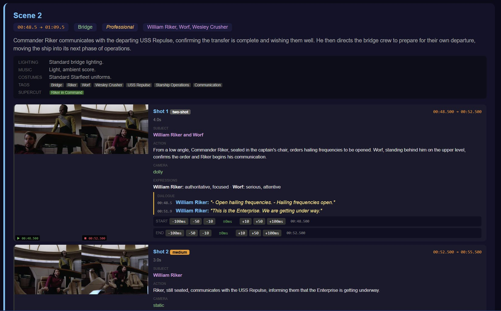

# vstack

AI-powered video production pipeline for [Claude Code](https://docs.anthropic.com/en/docs/claude-code). Analyze source footage, generate narration, match clips, and render finished videos — all from your terminal.



## What it does

vstack turns source video files into finished video essays, supercuts, and montages:

1. **Analyze** — Gemini 2.5 Pro scans videos in a reliable two-pass approach: first extracting rich scene metadata (location, characters, mood, lighting, music, costumes, dialogue), then drilling into shot-level detail (camera type, subject, expressions, tags, supercut categories)
2. **Review** — Interactive HTML Scene Review Report with first/last frame thumbnails, speaker-attributed dialogue, millisecond timestamp correction with live frame preview, and full scene metadata
3. **Search** — SQLite database with FTS5 full-text search across all analyzed episodes. Find any moment by character, expression, dialogue, action, or tag
4. **Narrate** — Write scripts and generate natural TTS audio via ElevenLabs with per-sentence splitting
5. **Assign** — AI matches narration segments to the best clips using the search database
6. **Render** — Preview in Remotion Studio or render final MP4

## Install

```bash
# Global install (available in all projects)
git clone https://github.com/GITWORX01/vstack.git ~/.claude/skills/vstack
cd ~/.claude/skills/vstack && ./setup

# Project-local install (team sharing via git)
cp -Rf ~/.claude/skills/vstack .claude/skills/vstack
```

### Prerequisites

- [Claude Code](https://docs.anthropic.com/en/docs/claude-code) CLI
- [Node.js](https://nodejs.org/) 18+
- [ffmpeg](https://ffmpeg.org/) — frame extraction and audio processing
- [Google Cloud SDK](https://cloud.google.com/sdk) with Vertex AI enabled — video analysis
- [ElevenLabs API key](https://elevenlabs.io/) — TTS narration (optional)
- [Python 3.9+](https://python.org) — speaker diarization (Tier 1.5)
- NVIDIA GPU recommended — speaker diarization runs ~15x faster on GPU

### Speaker Diarization Setup (Tier 1.5)

Tier 1.5 uses [pyannote-audio](https://github.com/pyannote/pyannote-audio) for local voice-based speaker identification. Free, runs on your GPU.

```bash
# Install dependencies (CUDA-enabled PyTorch for GPU)
pip install pyannote.audio scipy
pip install torch torchaudio --index-url https://download.pytorch.org/whl/cu128

# Create Hugging Face account and accept model terms:
# 1. Sign up at https://huggingface.co/join
# 2. Accept terms at https://huggingface.co/pyannote/speaker-diarization-3.1
# 3. Accept terms at https://huggingface.co/pyannote/segmentation-3.0
# 4. Create token at https://huggingface.co/settings/tokens (Read access)
# 5. Add to .env: HF_TOKEN=hf_your_token_here
```

## Skills (Slash Commands)

| Command | Description |
|---------|-------------|
| `/vstack-analyze` | Analyze video with Gemini 2.5 Pro — scenes, shots, dialogue |
| `/vstack-review` | Generate interactive Scene Review Report |
| `/vstack-narrate` | Write script + generate TTS audio |
| `/vstack-assign` | Match narration to best video clips |
| `/vstack-render` | Preview or render final video |
| `/vstack-supercut` | Quick supercut builder for specific moments |
| `/vstack-improve` | Read pipeline scripts and propose improvements |
| `/vstack-project` | Project init, save, load, status |

## Two-Pass Analysis

The analysis uses a reliable two-pass approach that eliminates the flakiness of asking for everything at once:

**Pass A (Scenes)** — Rich metadata per scene. Gemini always completes this reliably:
- Location, characters, mood, plot significance
- Lighting, music/score, costuming details
- Speaker-attributed dialogue (matched from SRT subtitles)
- Searchable tags and supercut potential categories

**Pass B (Shots)** — Camera-level detail per scene. Simple focused prompt, high success rate:
- Shot type (wide, medium, close-up, over-shoulder, etc.)
- Subject, action, character expressions
- Camera movement (static, pan, tilt, track, zoom)
- Tags and supercut potential per shot
- Sub-second timestamps snapped to ffmpeg scene detection cut points

## Cost Estimates

### Video Analysis (Gemini 2.5 Pro via Vertex AI)

Uses `MEDIA_RESOLUTION_LOW` and context caching to minimize cost.

| Scope | Episodes | Runtime | Without Cache | With Cache |
|-------|----------|---------|---------------|------------|
| Single episode | 1 | ~45 min | ~$3.40 | ~$2.10 |
| Season (22 eps) | 22 | ~16 hrs | ~$75 | ~$46 |
| Full series (176 eps) | 176 | ~132 hrs | ~$600 | ~$370 |

**Context caching** stores video tokens once per episode and reuses them across all chunk and shot requests at a 90% discount. Automatically created, reused on resume, and cleaned up after completion.

### Audio (ElevenLabs)

| Component | Cost |
|-----------|------|
| Narration (~500 words) | ~$0.50-1.00 |
| Interjections (30 clips) | ~$0.30 |

### Rendering

Local via Remotion — no API costs.

## SQLite Database

All analyzed metadata is stored in a SQLite database (`vstack.db`) with FTS5 full-text search. The database auto-rebuilds after each episode analysis using hash-based change detection.

```bash
node db.mjs --rebuild              # Rebuild from all scenes.json files
node db.mjs --rebuild S02E01       # Rebuild single episode
node db.mjs --search "picard smile"          # Search shots
node db.mjs --search-dialogue "make it so"   # Search dialogue
node db.mjs --verify               # Check DB vs JSON integrity
node db.mjs --stats                # Show database stats
```

### Schema

- **episodes** — ID, title, filename, duration, analysis cost
- **scenes** — Location, characters, mood, lighting, music, costumes, tags
- **shots** — Shot type, subject, action, expressions, camera, tags, supercut potential
- **dialogue** — Speaker, text, timestamps (linked to both scenes and shots)
- **shots_fts** — Full-text search index on shots (subject, action, tags, expressions)
- **dialogue_fts** — Full-text search index on dialogue (speaker, text)

### Data Flow

```
Gemini API --> chunk files --> scenes.json (report source)
                                   |
                              auto-rebuild
                                   |
                              vstack.db (AI search source)
```

The report reads from `scenes.json`. The AI clip selector searches `vstack.db`. Both stay in sync automatically.

## Configuration

Create `vstack.config.json` in your project root:

```json
{
  "projectDir": "./output",
  "ffmpegPath": "ffmpeg",
  "mediaDir": "/path/to/source/videos",
  "gcsBucket": "gs://your-bucket-name",
  "gcpProject": "your-gcp-project-id",
  "gcpRegion": "us-east1",
  "elevenLabsVoiceId": "your-voice-id",
  "model": "gemini-2.5-pro",
  "mediaResolution": "MEDIA_RESOLUTION_LOW",
  "chunkMinutes": 15,
  "maxRetries": 5
}
```

## Architecture

```
Source Video (.mp4) + SRT Subtitles
    |
    +-- Gemini 2.5 Pro (two-pass) --> Scene + Shot metadata (JSON)
    |     +-- Pass A: Scenes (metadata, dialogue, tags)
    |     +-- Pass B: Shots per scene (camera, expressions, tags)
    |
    +-- ffmpeg scene detection --> Exact cut timestamps (snap to +-200ms)
    |
    +-- Frame extraction --> First/last thumbnails per shot
    |
    +-- SQLite database --> FTS5 searchable index
    |
    +-- Scene Review Report (interactive HTML)
    |       +-- Timestamp correction with live frame preview
    |       +-- Lock, export, and apply corrections
    |
    +-- Narration Script --> ElevenLabs TTS --> Per-sentence audio
    |
    +-- AI Clip Assignment --> scenes.ts (Remotion config)
    |
    +-- Remotion Render --> Final MP4
```

## Resilience

Built to handle real-world API issues:

- **Two-pass analysis** — Scenes and shots analyzed separately for reliability (eliminates ~80% failure rate of single-pass)
- **Exponential backoff** — Rate limits trigger 30s/60s/120s/240s/480s retries (5 attempts)
- **Auto region failover** — Rotates through us-east1, us-central1, europe-west1, asia-northeast1 after 3 consecutive rate limits
- **Context cache auto-recreation** — If cache expires mid-run, automatically creates a new one and continues
- **JSON repair** — Auto-fixes Gemini formatting bugs (markdown fences, trailing commas, malformed objects)
- **Shot validation** — Never accepts scenes without shot data; forces retry
- **Truncation detection** — Catches `MAX_TOKENS` responses and retries
- **Stale frame clearing** — Clears frame directory before extraction to prevent numbering mismatches
- **Resume capability** — Batch processor saves state; `--resume` picks up where it left off
- **Chunk caching** — Successful chunks are cached and reused across runs

## Batch Processing

```bash
node batch-analyze.mjs --dry-run --season 2    # Cost estimate
node batch-analyze.mjs --season 2               # Process Season 2
node batch-analyze.mjs --season 2 --start 1 --end 5  # Range
node batch-analyze.mjs --resume                 # Resume after interrupt
node batch-analyze.mjs --status                 # Progress check
```

## Scene Review Report

Interactive HTML editing interface with full metadata at both scene and shot level:

**Scene level:**
- Location, characters, mood, plot significance
- Lighting, music/score, costuming details
- Tags and supercut potential categories

**Shot level:**
- First/last frame thumbnails
- Shot type, subject, action, character expressions
- Camera movement
- Speaker-attributed dialogue with timestamps
- Tags and supercut potential (in future analyses)
- Millisecond timestamp adjustment (+-10ms, +-50ms, +-100ms) with live frame preview
- Lock corrections and export for batch application

**Frame server** for live timestamp preview:
```bash
node lib/frame-server.mjs
# Serves frames at http://localhost:3333/frame?file=PATH&t=SECONDS
```

## Subagents

| Agent | Role |
|-------|------|
| `script-writer` | Narration scripts optimized for voiceover |
| `clip-matcher` | Finds best clips from metadata via DB search |
| `scene-reviewer` | Analyzes assignments, suggests improvements |
| `audio-engineer` | TTS generation, splitting, alignment |
| `pipeline-improver` | Reads scripts, proposes code changes |

## Safety

- **Destructive command blocking** — Prevents `rm -rf` inside media directories
- **Cost tracking** — Logs spend per API call, warns at budget limits
- **Audit logging** — All tool calls logged to `.claude/audit.log`

## License

MIT
